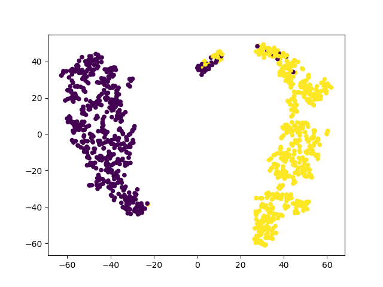

# Deep Anomaly Detection for Generalized Face Anti-Spoofing

This is an unofficial implemented code for paper "Deep Anomaly Detection for Generalized Face Anti-Spoofing" in pytorch.

This code works fine on our own dataset and is worth sharing.

The original paper can be find here in arxiv: https://arxiv.org/abs/1904.08241 

## Install

```
pip install torch torchvision tqdm albumentations
```

## Usage
First, make a dir containing positive and negative folder and place the corresponding image in the folder. 

Second, configure data path in dataset.py .

Then run training
```
python train.py
```[cmd]

For visualization,

First, generate the txt file for t-sne visuation.
```
python generate_txt_for_tsne.py
```[python]

Then, visuallize them
```
python t_sne.py
```[python]

The visual effect is as shown in the figure:


## Contributing

PRs accepted.

## License

MIT © Aoruxue